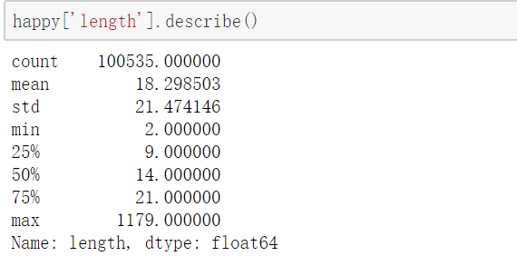
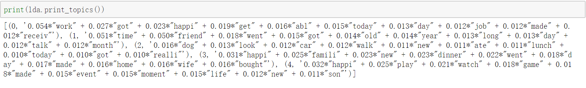
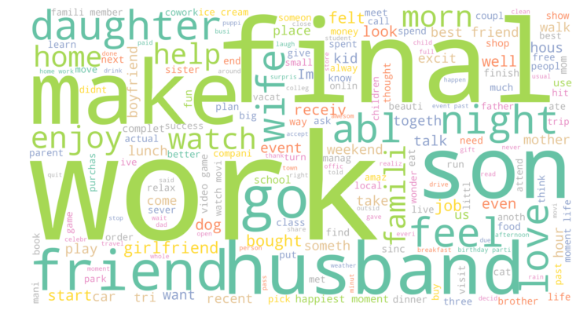
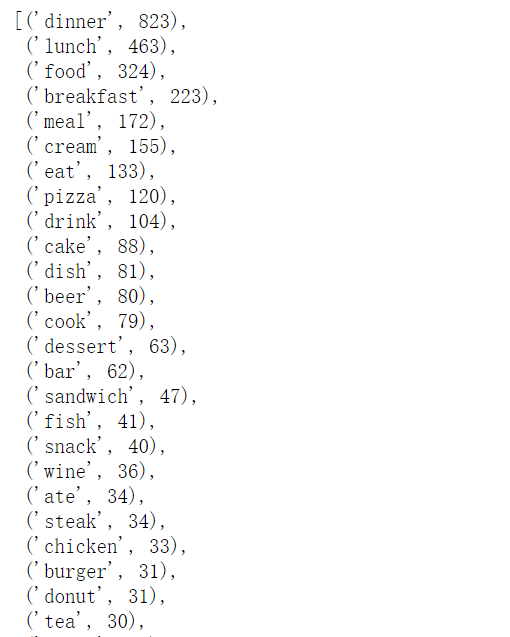
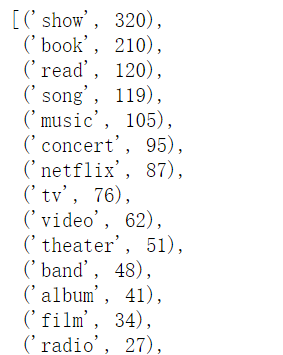
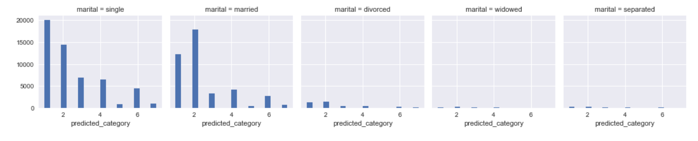
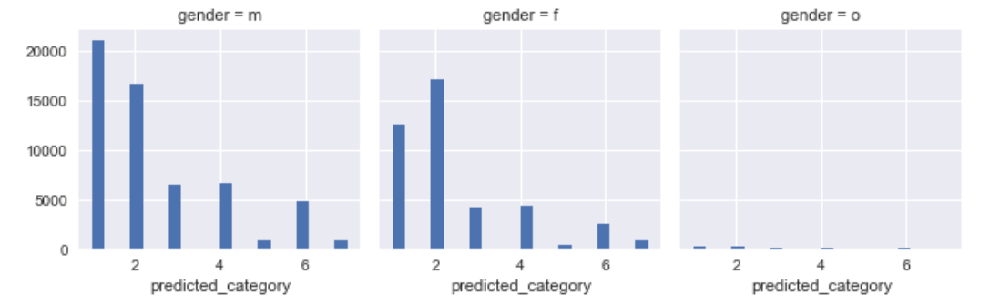
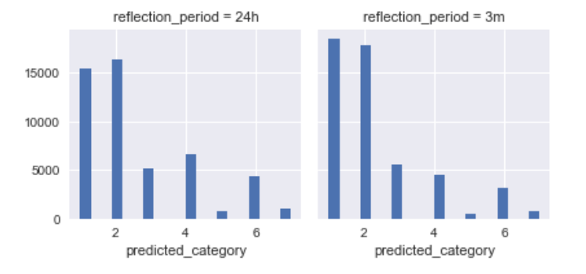
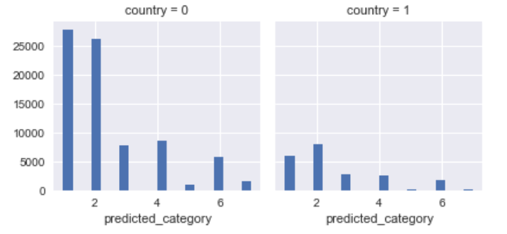
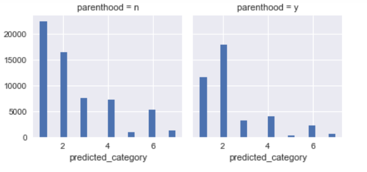

# Applied Data Science @ Columbia
## Spring 2019
## Project 1: What made you happy today?


### [Project Description](doc/Proj1_desc.md)
This is the first and only *individual* (as opposed to *team*) this semester. 

Term: Spring 2019

+ Projec title: Lorem ipsum dolor sit amet
+ This project is conducted by Qiaozhen MA (qm2138)

+ Project summary: 
### Data preparation and basic analysis
Prepare data and count the number of words in happy moments.
#### Finding


After basic analysis, I find that most happy moments are short sentences.
### Topic modelling (LDA) and word cloud
Using topic modelling to find topics of happy moment;
Visualizing frequency of words to find important words.
#### Finding


From topic modelling, the words are seperated to five groups:
Topic 1: work;
Topic 2: friend;
Topic 3: leisure;
Topic 4: family;
Topic 5: entertainment



From the word cloud, I find that most happy moments are correlated with work, family and friend.
### Entity extraction
Using other dataset in topic_dict to do a straighforward entity extraction of food and entertainment.
#### Finding


The most six frequent words related to food are dinner, lunch, food, breakfast, meal and cream. It is infered that people feel happier about dinner and the most enjoyable food is cream in the happyDB analysis.



The most five frequent words are show, book, read , song and music. Since book and read has similar meaning to some extent, and song , music are related. In conclusion, the top three happiest entertainment are watching shows, reading books and listening to music.
### Variate analysis
Compare happy moments between different groups.
#### Finding











Different groups have different predicted category of happy moments.


Following [suggestions](http://nicercode.github.io/blog/2013-04-05-projects/) by [RICH FITZJOHN](http://nicercode.github.io/about/#Team) (@richfitz). This folder is orgarnized as follows.

```
proj/
├── lib/
├── data/
├── doc/
├── figs/
└── output/
```

Please see each subfolder for a README file.
